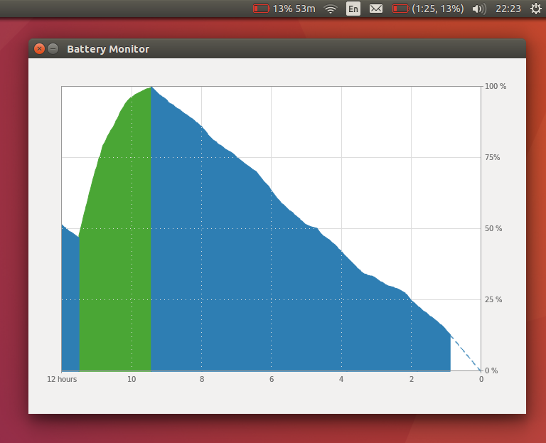
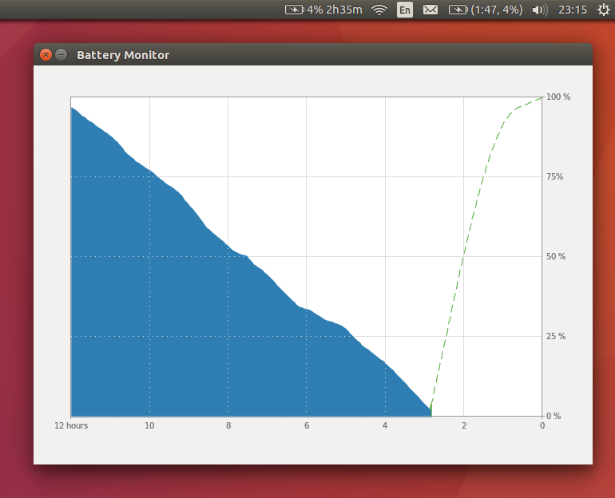
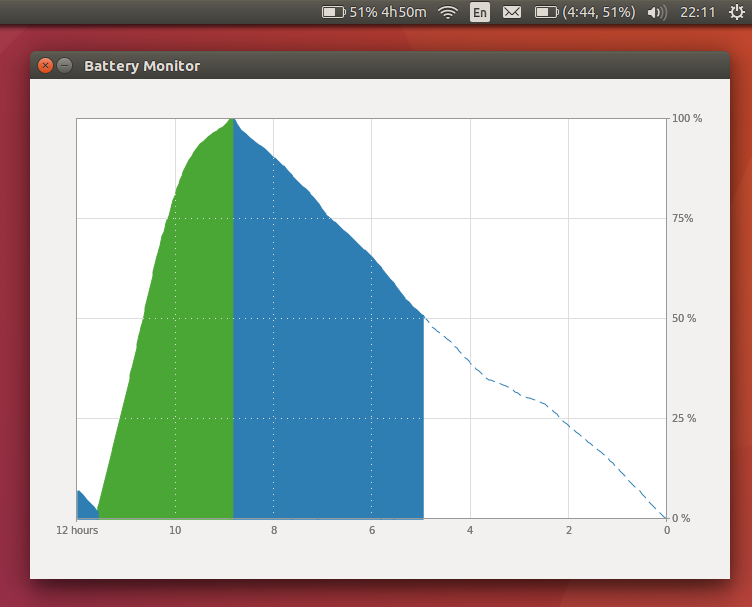
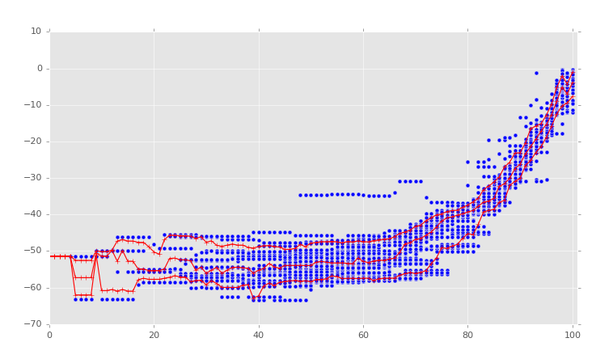
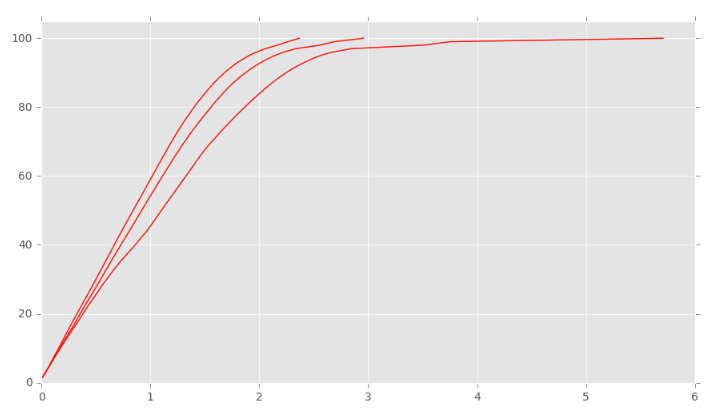
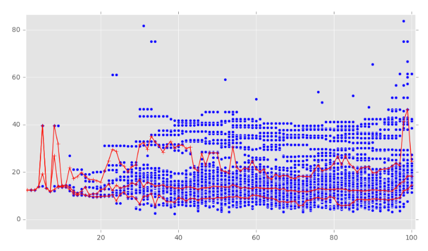
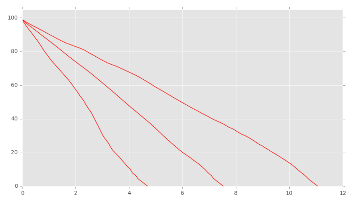

# Battery Monitor

<!-- MarkdownTOC -->

- [Brief Description](#brief-description)
- [Screenshots](#screenshots)
	- [Example #1](#example-1)
	- [Example #2](#example-2)
	- [Example #3](#example-3)
	- [Example #4](#example-4)
- [Prediction Algorithm](#prediction-algorithm)
- [Quick Links](#quick-links)
- [Dependencies](#dependencies)
	- [Usage](#usage)
	- [Build tools](#build-tools)
- [Installation](#installation)
- [Uninstallation](#uninstallation)
- [Licensing](#licensing)
- [Reference Links](#reference-links)

<!-- /MarkdownTOC -->

## Brief Description

Battery Monitor is an application for Ubuntu laptops that tracks battery capacity and provides time-to-end prediction. It has a simple user interface that gives just enough information to answer the following questions:

- what is current capacity?
- what is predicted time-to-end (time to full charge/discharge)?
- what is recent capacity history?
- what is predicted capacity trend?

Predicted time-to-end is a rough estimation. In order not to give a false feeling of high precision the result is rounded (max. error 4.2%):

- up to 1 minute for values within 0...2 hours
- up to 5 minutes for values within 2...4 hours
- up to 10 minutes for values within 4...8 hours
- up to 20 minutes for values within 8...12 hours
- up to 30 minutes for values within 12...24 hours
- up to 1 hour for values higher than 24 hours

## Screenshots

### Example #1

How to read this information:

- discharging, current capacity is 51%
- predicted time to full discharge is 4 hours 50 minutes
- it is going to be about 9 hours to fully discharge from 100%
- predicted discharging trend is roughly linear (depends on previous statistics)

### Example #2

How to read this information:

- discharging, current capacity is 13%
- predicted time to full discharge is 53 minutes
- it is going to be about 9.5 hours to fully discharge from 100%
- predicted discharging trend is linear

### Example #3

How to read this information:

- charging, current capacity is 4%, almost discharged
- predicted time to full charge is 2 hours 35 minutes
- predicted charging trend is exponential

### Example #4

How to read this information:

- charging, current capacity is 100%, fully charged
- it took about 2.5 hours to fully charge (almost as predicted!!!)

## Prediction Algorithm

Given capacity history logs it's possible to calculate slopes in every point. Collect all the slopes and put them in buckets according to capacity percentage (with 1% step, blue dots). Then calculate slopes for different percentiles (10%, 50%, 90%) and connect the dots (red lines).

When you have slopes for every capacity value it's possible to reconstruct a capacity timeline. 

There are three charging timelines for different percentiles (10%, 50%, 90%). How to read this information:

- 10% of cases charged from 0% to 100% in less than ~2.3 hours
- 50% of cases charged from 0% to 100% in less than ~2.8 hours
- 90% of cases charged from 0% to 100% in less than ~5.7 hours

The same applies to discharging. The only difference is the shape of slope and timeline charts. Unlike to exponential shape for charging its shape is close to linear for discharging.

Slopes:

Timelines:

- 10% of cases discharged from 100% to 0% in less than ~4.5 hours
- 50% of cases discharged from 100% to 0% in less than ~7.5 hours
- 90% of cases discharged from 100% to 0% in less than ~11 hours

## Quick Links

- [Release Notes](release-notes.md)
- [TODO](todo.md)

## Dependencies

### Usage

- On Debian/Ubuntu: `sudo apt-get install --reinstall python-gi`
- On Arch: `sudo pacman -S python-gobject libappindicator-gtk3`

### Build tools

- `sudo pip install coverage`

## Installation

Non-root, non-sudo user installation is supported. Application will be installed in `/home/{$USER}/.local/batterym/` folder. After installation the file `install_log.txt` should appear in the source folder.

- run `./install.sh`
- save `install_log.txt` for the later uninstallation
- add `batterym` to `Startup Applications`

## Uninstallation

Make sure you have `install_log.txt` next to `uninstall.sh`.

- run `./uninstall.sh`

## Licensing

Apache License, Version 2.0. See LICENSE for the full license text.

## Reference Links

- Article: [Why Apple is removing ‘time remaining’ battery life estimates following MacBook Pro complaints](https://9to5mac.com/2016/12/13/why-apple-is-removing-time-remaining-battery-life-estimates-macbook-pro/)
- Blog: [Create an Ubuntu Application Indicator in Python: step-by-step guide](http://candidtim.github.io/appindicator/2014/09/13/ubuntu-appindicator-step-by-step.html)
- Ask Ubuntu: [How can I write a dynamically updated panel app / indicator?](http://askubuntu.com/questions/751608/how-can-i-write-a-dynamically-updated-panel-app-indicator)
- Ask Ubuntu: [Textual / speaking clock for Mate and other Ubuntu variants](http://askubuntu.com/questions/750815/fuzzy-clock-for-ubuntu/752675#752675)
- Ask Ubuntu: [How can I change the application indicator label after delay?](http://askubuntu.com/questions/150970/how-can-i-change-the-application-indicator-label-after-delay)
- Stackoverflow: [Showing a gtk.Calendar in a menu?](http://stackoverflow.com/questions/11132929/showing-a-gtk-calendar-in-a-menu)
