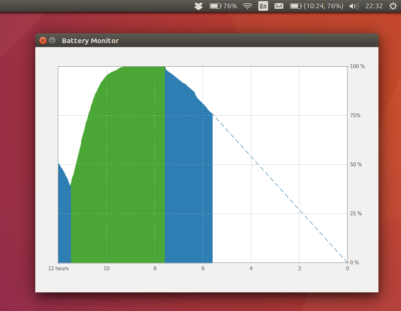
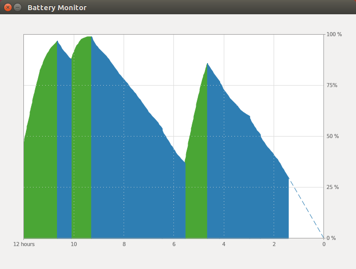

# Battery Monitor

Battery Monitor is an application for Ubuntu laptops that provides timeline power usage and prediction graph.

## Dependencies

### Usage

- Python 2.7
- `sudo apt-get install --reinstall python-gi`

### Build tools

- `sudo pip install coverage`

## Installation

Non-root, non-sudo user installation is supported. Application will be installed in `/home/{$USER}/.local/batterym/` folder. After installation the file `install_log.txt` should appear in the source folder.

- run `./install.sh`
- save `install_log.txt` for the later uninstallation
- add `batterym` to `Startup Applications`

## Uninstallation

Make sure you have `install_log.txt` next to `uninstall.sh`.

- run `./uninstall.sh`

## Licensing

Apache License, Version 2.0. See LICENSE for the full license text.

## TODO

- [x] Preserve history after reinstall
- [x] Add config (theme, smoothing, etc)
- [x] Remember theme selection after restart
- [x] Dependencies for build tools (e.g. coverage)
- [x] Install as non root user
- [ ] Limit log file size / logrotate
- [ ] use d-bus interface
- [ ] pip / anaconda
- [ ] use python3

## Links

- http://candidtim.github.io/appindicator/2014/09/13/ubuntu-appindicator-step-by-step.html
- http://askubuntu.com/questions/751608/how-can-i-write-a-dynamically-updated-panel-app-indicator
- http://askubuntu.com/questions/750815/fuzzy-clock-for-ubuntu/752675#752675
- http://askubuntu.com/questions/150970/how-can-i-change-the-application-indicator-label-after-delay
- http://stackoverflow.com/questions/11132929/showing-a-gtk-calendar-in-a-menu
